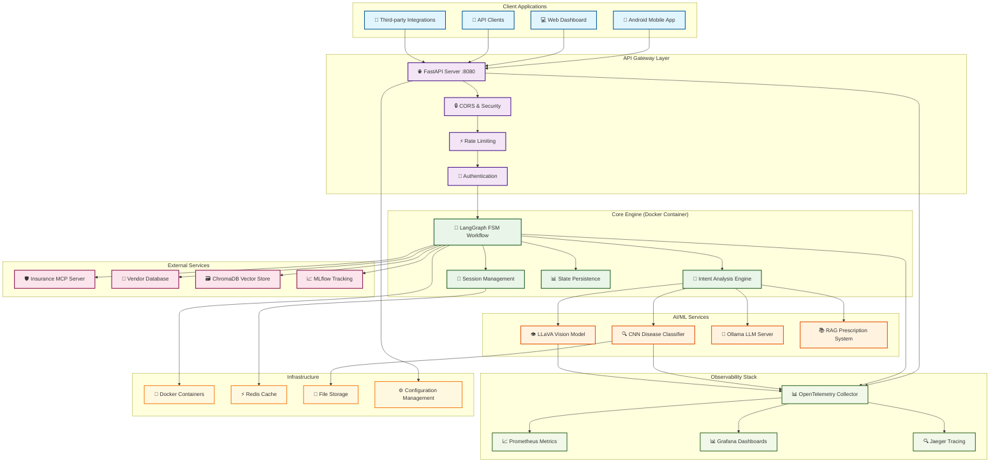
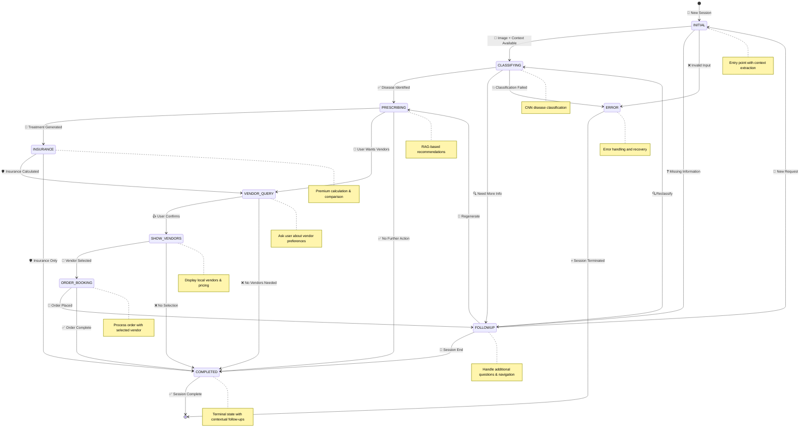
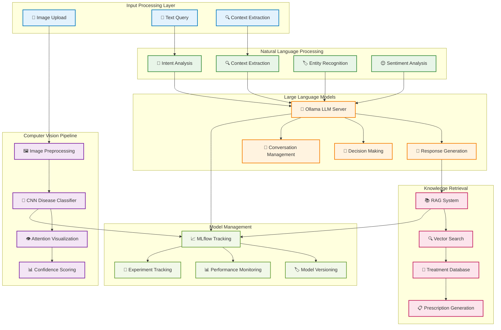
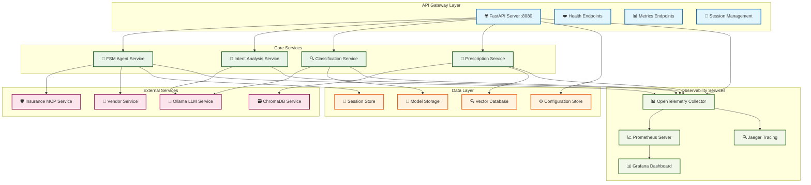
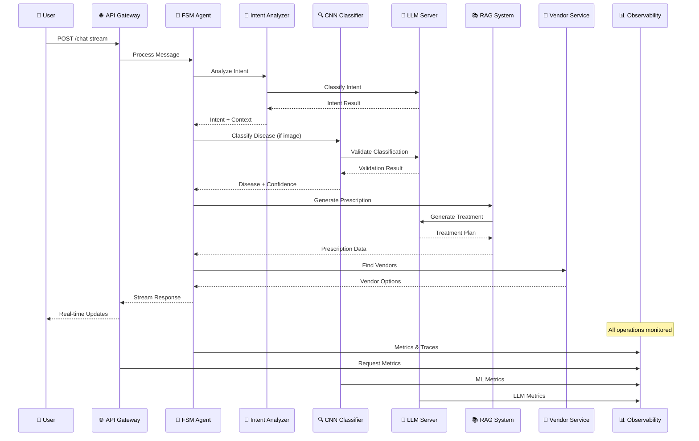
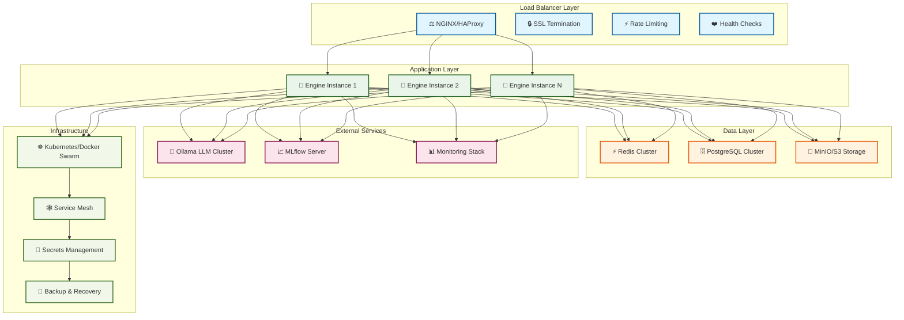
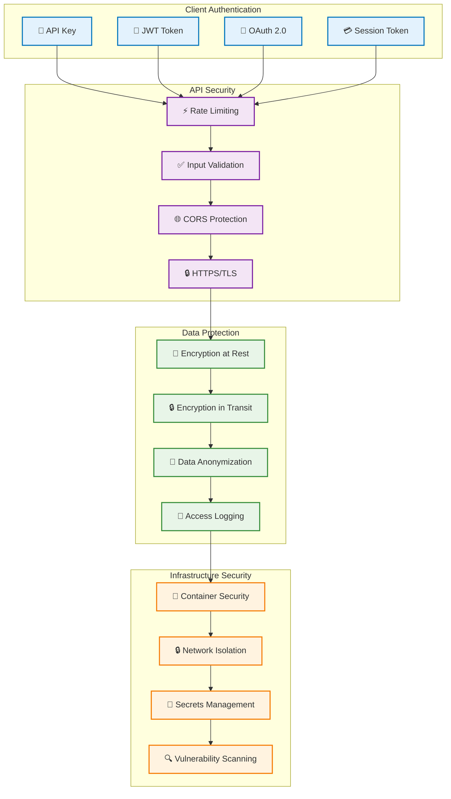
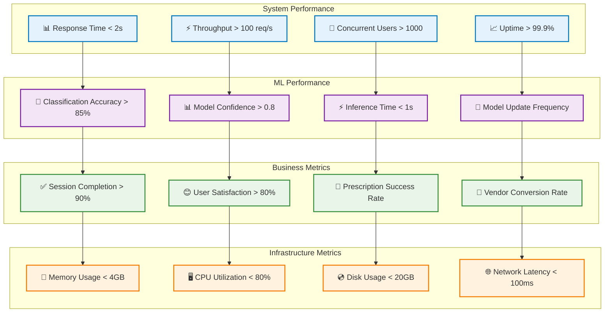

# 🏗️ Sasya Arogya Engine - Architecture Diagrams

This document contains comprehensive visual diagrams of the Sasya Arogya Engine architecture, suitable for technical presentations, project reports, and documentation.

## System Overview Architecture



## LangGraph Workflow State Machine



## AI/ML Pipeline Architecture



## Microservices Architecture



## Data Flow Sequence



## Observability & Monitoring Stack

```mermaid
graph TB
    subgraph "Application Layer"
        A[🌐 FastAPI Server]
        B[🔄 FSM Workflow]
        C[🧠 ML Models]
        D[🔌 External Services]
    end
    
    subgraph "Instrumentation Layer"
        E[📊 OpenTelemetry SDK]
        F[📈 Custom Metrics]
        G[🔍 Distributed Tracing]
        H[📝 Structured Logging]
    end
    
    subgraph "Collection & Processing"
        I[📊 OTel Collector]
        J[📈 Prometheus Scraper]
        K[📝 Log Aggregator]
        L[🔍 Trace Processor]
    end
    
    subgraph "Storage & Analysis"
        M[📈 Prometheus TSDB]
        N[🔍 Jaeger Backend]
        O[📊 Grafana Dashboards]
        P[🚨 Alert Manager]
    end
    
    subgraph "Visualization Layer"
        Q[📊 System Health Dashboard]
        R[🧠 ML Performance Dashboard]
        S[📈 Business Metrics Dashboard]
        T[❌ Error Analysis Dashboard]
    end
    
    A --> E
    B --> E
    C --> E
    D --> E
    
    E --> F
    E --> G
    E --> H
    
    F --> I
    G --> I
    H --> K
    
    I --> J
    J --> M
    K --> M
    L --> N
    
    M --> O
    N --> O
    O --> Q
    O --> R
    O --> S
    O --> T
    
    M --> P
    P --> Q
    
    classDef appLayer fill:#e3f2fd,stroke:#0277bd,stroke-width:2px
    classDef instrumentationLayer fill:#f3e5f5,stroke:#7b1fa2,stroke-width:2px
    classDef collectionLayer fill:#e8f5e8,stroke:#388e3c,stroke-width:2px
    classDef storageLayer fill:#fff3e0,stroke:#f57c00,stroke-width:2px
    classDef visualizationLayer fill:#fce4ec,stroke:#c2185b,stroke-width:2px
    
    class A,B,C,D appLayer
    class E,F,G,H instrumentationLayer
    class I,J,K,L collectionLayer
    class M,N,O,P storageLayer
    class Q,R,S,T visualizationLayer
```

## Deployment Architecture



## Security Architecture



## Performance Metrics Dashboard



## Technology Stack Overview

```mermaid
graph TB
    subgraph "Frontend Technologies"
        A[📱 Android (Kotlin/Java)]
        B[💻 Web (React/Vue.js)]
        C[🔌 REST API Clients]
    end
    
    subgraph "Backend Technologies"
        D[🐍 Python 3.11+]
        E[⚡ FastAPI Framework]
        F[🔄 LangGraph Workflow]
        G[🧠 LangChain Tools]
    end
    
    subgraph "AI/ML Technologies"
        H[🧠 TensorFlow 2.15+]
        I[🤖 Ollama LLM Server]
        J[🔍 ChromaDB Vector DB]
        K[📈 MLflow Tracking]
    end
    
    subgraph "Data Technologies"
        L[⚡ Redis Cache]
        M[🗄️ PostgreSQL Database]
        N[💾 MinIO/S3 Storage]
        O[📊 Time Series DB]
    end
    
    subgraph "Observability Technologies"
        P[📊 OpenTelemetry]
        Q[📈 Prometheus]
        R[📊 Grafana]
        S[🔍 Jaeger Tracing]
    end
    
    subgraph "Infrastructure Technologies"
        T[🐳 Docker Containers]
        U[☸️ Kubernetes]
        V[🌐 NGINX Load Balancer]
        W[🔧 Helm Charts]
    end
    
    A --> D
    B --> D
    C --> D
    
    D --> E
    E --> F
    F --> G
    
    G --> H
    G --> I
    G --> J
    G --> K
    
    E --> L
    E --> M
    E --> N
    E --> O
    
    D --> P
    E --> P
    F --> P
    G --> P
    
    P --> Q
    P --> R
    P --> S
    
    D --> T
    E --> T
    F --> T
    G --> T
    
    T --> U
    U --> V
    V --> W
    
    classDef frontendTech fill:#e3f2fd,stroke:#0277bd,stroke-width:2px
    classDef backendTech fill:#e8f5e8,stroke:#1b5e20,stroke-width:2px
    classDef mlTech fill:#fff3e0,stroke:#f57c00,stroke-width:2px
    classDef dataTech fill:#fce4ec,stroke:#c2185b,stroke-width:2px
    classDef observabilityTech fill:#f1f8e9,stroke:#33691e,stroke-width:2px
    classDef infraTech fill:#f3e5f5,stroke:#7b1fa2,stroke-width:2px
    
    class A,B,C frontendTech
    class D,E,F,G backendTech
    class H,I,J,K mlTech
    class L,M,N,O dataTech
    class P,Q,R,S observabilityTech
    class T,U,V,W infraTech
```

---

## Usage Instructions

These diagrams can be used in various ways:

1. **Technical Presentations**: Use individual diagrams to explain specific aspects of the architecture
2. **Project Reports**: Include relevant diagrams to illustrate system design and components
3. **Documentation**: Reference diagrams in technical documentation and README files
4. **Code Reviews**: Use diagrams to understand system interactions and data flow
5. **Onboarding**: Help new team members understand the system architecture

## Diagram Formats

- **Mermaid**: Native support in GitHub, GitLab, and many documentation platforms
- **PNG/SVG**: Export from Mermaid Live Editor or VS Code Mermaid extension
- **PDF**: Convert for formal documentation and presentations

## Customization

To customize these diagrams:

1. Copy the Mermaid code to [Mermaid Live Editor](https://mermaid.live/)
2. Modify colors, shapes, and connections as needed
3. Export in your preferred format
4. Update the source files with your changes

---

*These architecture diagrams provide a comprehensive visual representation of the Sasya Arogya Engine system, suitable for technical documentation, presentations, and project reports.*
