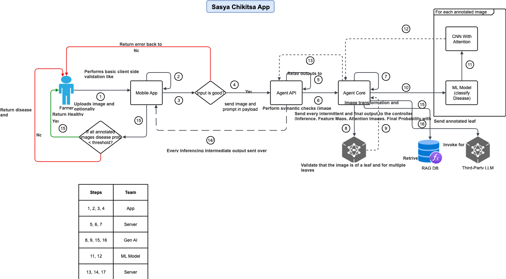

# 🌾 Sasya Arogya Engine

**Complete Agricultural Intelligence Platform with Crop Insurance Integration**



*Comprehensive agricultural assistance system providing plant disease diagnosis, treatment recommendations, crop insurance services, and vendor connections*

## 🎯 Overview

The Sasya Arogya Engine is a comprehensive agricultural intelligence platform that provides:

- 🔬 **Plant Disease Diagnosis** - AI-powered disease classification from plant images
- 💊 **Treatment Recommendations** - Personalized prescription and care instructions  
- 🏦 **Crop Insurance Services** - Premium calculation, policy recommendations, and coverage options
- 🛒 **Vendor Connections** - Agricultural supplier and product sourcing
- 🧠 **Intelligent Workflow** - Context-aware routing and multi-service integration

## 🏗️ System Architecture

> 🔧 **For detailed architecture diagrams and technical specifications, see [ARCHITECTURE.md](./ARCHITECTURE.md)**

### High-Level Architecture

```
┌─────────────────────┐    ┌─────────────────────┐    ┌─────────────────────┐
│                     │    │                     │    │                     │
│   Android App       │◄──►│  Sasya Arogya       │◄──►│   External Services │
│                     │    │  Engine (FastAPI)   │    │                     │
│ • Multi-session     │    │                     │    │ • Prescription RAG  │
│ • Image upload      │    │ • LangGraph FSM     │    │ • MCP Server        │
│ • WhatsApp UI       │    │ • Session mgmt      │    │ • Ollama LLM        │
│                     │    │ • Multi-service     │    │                     │
└─────────────────────┘    └─────────────────────┘    └─────────────────────┘
```

### FSM Workflow Architecture

```
┌──────────┐    ┌──────────────┐    ┌─────────────────┐
│          │    │              │    │                 │
│ Initial  │───►│  Followup    │───►│   Completed     │
│   Node   │    │    Node      │    │     Node        │
│          │    │              │    │                 │
└──────────┘    └──────────────┘    └─────────────────┘
     │                  │
     ▼                  ▼
┌──────────────────────────────────────────────────────┐
│             Service Nodes                            │
├──────────────┬──────────────┬──────────────┬─────────┤
│              │              │              │         │
│Classifying   │ Prescribing  │  Insurance   │ Vendors │
│    Node      │    Node      │    Node      │  Node   │
│              │              │              │         │
│ • Disease ID │ • Treatment  │ • Premium    │ • Find  │
│ • Confidence │ • Dosage     │ • Coverage   │ • Price │
│ • Severity   │ • Safety     │ • Companies  │ • Order │
│              │              │              │         │
└──────────────┴──────────────┴──────────────┴─────────┘
```

### Intent Analysis Architecture

```
┌─────────────────────┐    ┌─────────────────────────┐    ┌────────────────┐
│                     │    │                         │    │                │
│   User Message      │───►│ Agriculture Intent      │───►│  Route to      │
│                     │    │      Analyzer           │    │ Appropriate    │
│ "I need crop        │    │                         │    │    Node        │
│  insurance for      │    │ • Rule-based system     │    │                │
│  my wheat farm"     │    │ • Configurable rules    │    │ insurance →    │
│                     │    │ • Extensible design     │    │ InsuranceNode  │
└─────────────────────┘    └─────────────────────────┘    └────────────────┘
                                      │
                                      ▼
                           ┌─────────────────────────┐
                           │    Intent Rules         │
                           ├─────────────────────────┤
                           │ • Insurance keywords    │
                           │ • Vendor keywords       │
                           │ • Treatment keywords    │
                           │ • Priority scoring      │
                           │ • Context requirements  │
                           └─────────────────────────┘
```

### MCP Integration Architecture

```
┌─────────────────────┐    ┌─────────────────────┐    ┌─────────────────────┐
│                     │    │                     │    │                     │
│ Insurance Tool      │───►│  HTTP Client        │───►│ Sasya Arogya       │
│                     │    │                     │    │ MCP Server          │
│ • Calculate premium │    │ • POST /tools/call  │    │                     │
│ • Get companies     │    │ • JSON payloads     │    │ • Premium calc      │
│ • Recommendations   │    │ • Error handling    │    │ • Company data      │
│ • Generate cert     │    │ • Timeout mgmt      │    │ • PDF generation    │
│                     │    │                     │    │                     │
└─────────────────────┘    └─────────────────────┘    └─────────────────────┘
```

## ✨ Key Features

### 🔬 Plant Disease Diagnosis
- **AI-Powered Classification**: Advanced CNN models with attention mechanisms
- **Multi-Plant Support**: Supports various crops and plant types
- **Confidence Scoring**: Reliability indicators for diagnoses
- **Severity Assessment**: Disease progression analysis

### 💊 Treatment Recommendations  
- **Personalized Prescriptions**: Tailored treatment plans based on diagnosis
- **Dosage Instructions**: Precise application guidelines
- **Safety Protocols**: Farmer and environmental safety measures  
- **Organic Alternatives**: Chemical and organic treatment options

### 🏦 Crop Insurance Services
- **Premium Calculation**: Accurate cost estimation based on crop, area, and location
- **Policy Recommendations**: AI-driven insurance suggestions
- **Company Comparisons**: Multi-provider analysis and ratings
- **Certificate Generation**: Automated policy document creation
- **Optional Disease Coverage**: Insurance available with or without disease context

### 🛒 Agricultural Vendor Services
- **Supplier Discovery**: Find local agricultural suppliers
- **Product Sourcing**: Pesticides, fertilizers, equipment, and tools
- **Price Comparisons**: Multi-vendor pricing analysis
- **Order Management**: Streamlined procurement workflow

### 🧠 Intelligent Features
- **Context-Aware Routing**: Smart intent analysis distinguishes "buy insurance" vs "buy pesticides"
- **Session Management**: Multi-conversation support with state persistence
- **Infinite Loop Prevention**: Robust handling of missing information scenarios
- **Extensible Architecture**: Easy addition of new services without code changes

## 📚 Documentation

- **[Architecture Overview](./ARCHITECTURE.md)** - Detailed system architecture and component interactions
- **[Deployment Guide](./DEPLOYMENT.md)** - Complete deployment instructions for all environments
- **[API Documentation](http://localhost:8080/docs)** - Interactive API documentation (when server is running)

## 🚀 Quick Start

### Prerequisites
- Python 3.11+
- UV package manager
- Ollama (for LLM inference)
- Docker/Podman (for containerized deployment)

> 📖 **For detailed deployment instructions, see [DEPLOYMENT.md](./DEPLOYMENT.md)**

### 1. Engine Setup

```bash
# Clone the repository
git clone <repository-url>
cd sasya-arogya-engine

# Initialize with UV
uv init

# Create virtual environment
uv add fastapi typing asyncio uvicorn python-multipart

# Activate environment
source .venv/bin/activate

# Install additional dependencies
uv pip install -r requirements.txt
```

### 2. MCP Server Setup

```bash
# Clone and setup MCP server
git clone <mcp-server-url>
cd sasya-arogya-mcp

# Install dependencies
pip install -r requirements.txt

# Start MCP server
python mcp_http_server.py --port 8001
```

### 3. Environment Configuration

Create `.env` file in the engine directory:

```env
# Core Configuration  
OLLAMA_BASE_URL=http://localhost:11434
PRESCRIPTION_ENGINE_URL=http://localhost:8081

# Insurance Services
SASYA_AROGYA_MCP_URL=http://localhost:8001

# MLflow (optional)
MLFLOW_TRACKING_URI=http://localhost:5000
```

### 4. Start the Engine

```bash
# Development mode
uvicorn api.agent_api:app --host 0.0.0.0 --port 8080 --reload 

# Production mode (containerized)
podman run -it --rm --name engine -p 8080:8080 --env-file .env localhost/engine:arm64-v6.1
```

## 📚 API Documentation

### Core Endpoints

#### Chat Stream (Primary Interface)
```bash
POST /chat-stream
Content-Type: application/json

{
  "message": "I need crop insurance for my 5 hectare wheat farm in Punjab",
  "session_id": "user-session-123",
  "image_b64": "<base64-encoded-image>", // Optional
  "text": "Additional context"  // Optional
}
```

#### Session Management
```bash
# Get session info
GET /session/{session_id}

# Reset session
POST /session/{session_id}/reset

# List all sessions  
GET /sessions
```

### Service-Specific Examples

#### Plant Disease Diagnosis
```bash
curl -X POST http://localhost:8080/chat-stream \
  -H "Content-Type: application/json" \
  -d '{
    "message": "Please diagnose this plant disease",
    "session_id": "diagnosis-session",
    "image_b64": "'$(base64 -i leaf_image.jpg)'"
  }'
```

#### Crop Insurance Request
```bash
curl -X POST http://localhost:8080/chat-stream \
-H "Content-Type: application/json" \
  -d '{
    "message": "I want crop insurance for my 3 hectare rice farm in Tamil Nadu",
    "session_id": "insurance-session"  
  }'
```

#### Treatment Recommendations
```bash
curl -X POST http://localhost:8080/chat-stream \
  -H "Content-Type: application/json" \
  -d '{
    "message": "Give me treatment for leaf blight disease",
    "session_id": "treatment-session"
  }'
```

#### Vendor Services
```bash
curl -X POST http://localhost:8080/chat-stream \
-H "Content-Type: application/json" \
  -d '{
    "message": "I need to buy organic pesticides for my tomato crop",
    "session_id": "vendor-session"
  }'
```

## 🧪 Testing

### Run Integration Tests
```bash
# Test insurance integration
python test_insurance_integration.py

# Test full workflow
python -m pytest tests/

# Test individual components
python -m pytest tests/test_insurance_node.py -v
```

### Example Test Scenarios

1. **Complete Workflow Test**: Disease diagnosis → Treatment → Insurance → Vendors
2. **Insurance-Only Test**: Direct insurance request without disease context  
3. **Multi-Session Test**: Concurrent sessions with different workflows
4. **Error Handling Test**: Network failures, invalid inputs, timeout scenarios

## 🔧 Configuration

### Intent Analysis Rules

The system uses a configurable intent analyzer that can be extended:

```python
from fsm_agent.core.intent_analyzer import IntentRule, intent_analyzer

# Add new service
weather_rule = IntentRule(
    service="weather",
    keywords=["weather", "forecast", "climate", "rainfall"],
    exclusions=[],
    context_required=[],
    priority=8
)

intent_analyzer.add_custom_rule(weather_rule)
```

### Environment Variables

| Variable | Default | Description |
|----------|---------|-------------|
| `OLLAMA_BASE_URL` | `http://localhost:11434` | Ollama LLM server URL |
| `PRESCRIPTION_ENGINE_URL` | `http://localhost:8081` | Prescription RAG server URL |
| `SASYA_AROGYA_MCP_URL` | `http://localhost:8001` | Insurance MCP server URL |
| `MLFLOW_TRACKING_URI` | `http://localhost:5000` | MLflow tracking server |

## 📈 Monitoring & Observability

### MLflow Integration
- **Experiment Tracking**: Model performance and metrics
- **Model Registry**: Version control for ML models  
- **Deployment Tracking**: Production model monitoring

### Logging
- **Structured Logging**: JSON-formatted logs with correlation IDs
- **Performance Metrics**: Response times, success rates, error rates
- **Business Metrics**: Insurance conversions, treatment adherence, user engagement

### Health Checks
```bash
# Engine health
GET /health

# MCP server health  
GET http://localhost:8001/health

# Component status
GET /status
```

## 🔒 Security

- **Session Isolation**: Each user session is completely isolated
- **Input Validation**: Comprehensive request validation and sanitization
- **Rate Limiting**: API rate limits to prevent abuse
- **Error Handling**: Graceful error handling without information leakage

## 🤝 Contributing

### Development Setup
```bash
# Development dependencies
uv add --dev pytest black flake8 mypy

# Pre-commit hooks
pre-commit install

# Run tests
python -m pytest

# Code formatting
black fsm_agent/ tests/

# Type checking  
mypy fsm_agent/
```

### Architecture Guidelines

1. **Separation of Concerns**: Each node handles a single responsibility
2. **Extensibility**: Use the intent analyzer for new services
3. **Error Handling**: Graceful degradation with meaningful error messages
4. **Testing**: Comprehensive test coverage for all components
5. **Documentation**: Keep README and code documentation updated

## 📋 Roadmap

### Planned Features
- [ ] **Weather Advisory Service**: Crop-specific weather recommendations
- [ ] **Soil Testing Integration**: Soil health analysis and recommendations  
- [ ] **Market Price Intelligence**: Real-time crop pricing and market analysis
- [ ] **IoT Sensor Integration**: Real-time field monitoring data
- [ ] **Mobile Offline Mode**: Core functionality without internet connectivity

### Technical Improvements
- [ ] **GraphQL API**: More flexible API for mobile applications
- [ ] **Kubernetes Deployment**: Production-ready container orchestration
- [ ] **Multi-Language Support**: Localization for regional languages
- [ ] **Performance Optimization**: Response time improvements and caching
- [ ] **Advanced Analytics**: User behavior analysis and recommendation engine

## 📄 License

This project is licensed under the MIT License - see the [LICENSE](LICENSE) file for details.

## 🙏 Acknowledgments

- **OpenAI** for GPT model capabilities
- **LangChain/LangGraph** for workflow orchestration
- **Ollama** for local LLM inference
- **MLflow** for experiment tracking
- **FastAPI** for high-performance API framework

---

**Built with ❤️ by the Sasya Arogya Team**

For questions or support, please contact: [support@sasyaarogya.com](mailto:support@sasyaarogya.com)