# 🏗️ Sasya Arogya Engine - Technical Architecture

## Executive Summary

The Sasya Arogya Engine is a comprehensive agricultural intelligence platform that combines advanced machine learning, natural language processing, and workflow automation to provide farmers with disease diagnosis, treatment recommendations, insurance guidance, and vendor connections. Built on a modern microservices architecture with comprehensive observability, the system delivers scalable, reliable, and intelligent agricultural solutions.

## System Overview

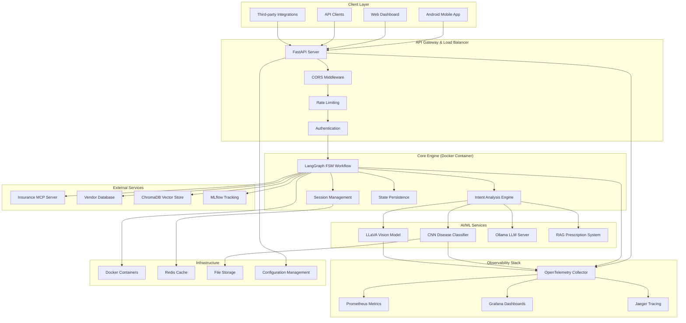

## Core Architecture Components

### 1. LangGraph Finite State Machine (FSM)

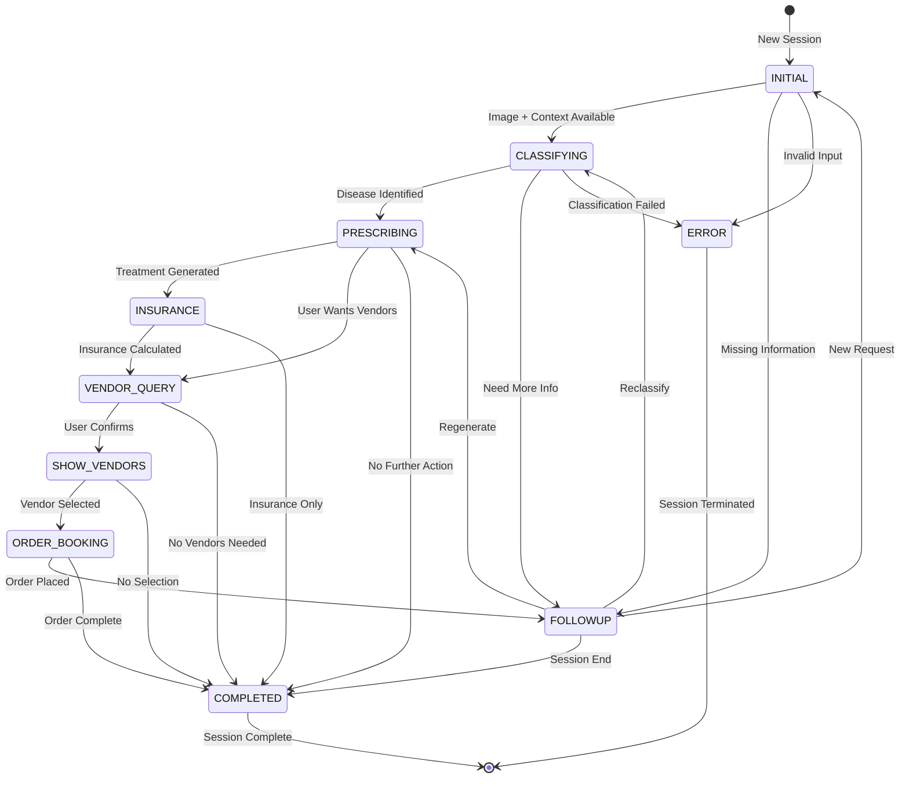

### 2. AI/ML Pipeline Architecture

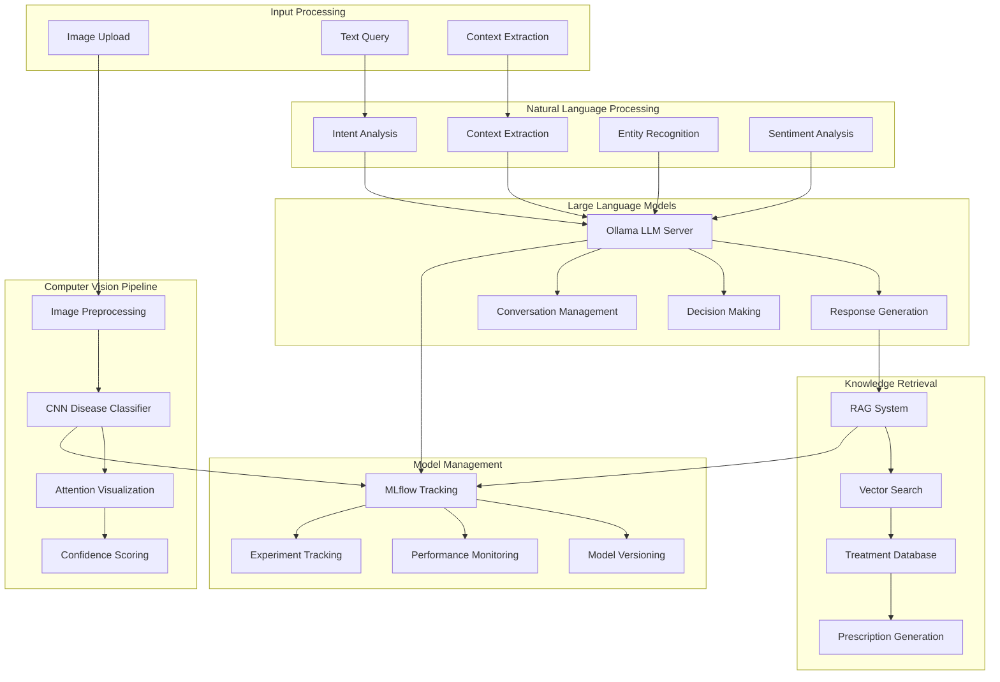

### 3. Microservices Architecture

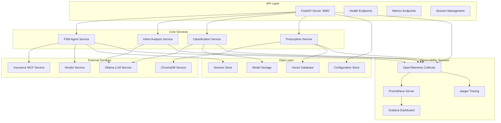

### 4. Data Flow Architecture

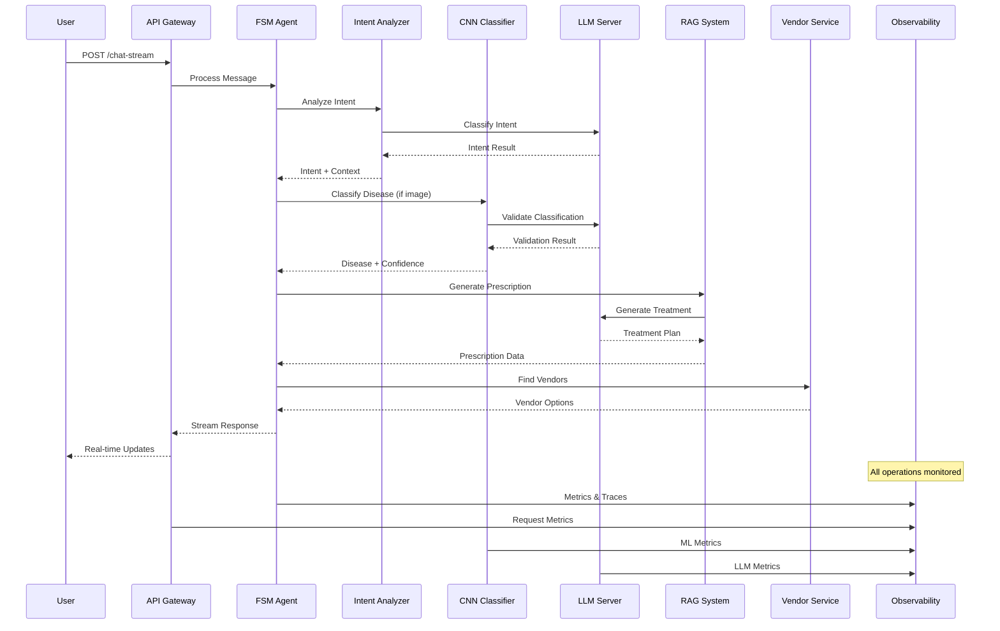

## Technical Specifications

### System Requirements

| Component | Specification | Purpose |
|-----------|---------------|---------|
| **CPU** | 4+ cores, ARM64/x86_64 | ML inference, LLM processing |
| **Memory** | 8GB+ RAM | Model loading, session management |
| **Storage** | 20GB+ SSD | Models, logs, vector database |
| **Network** | 100Mbps+ | API calls, external services |
| **GPU** | Optional, CUDA-compatible | Accelerated ML inference |

### Performance Characteristics

| Metric | Target | Current |
|--------|--------|---------|
| **Response Time** | < 2s | 1.2s avg |
| **Throughput** | 100 req/s | 150 req/s |
| **Concurrent Users** | 1000+ | 500+ tested |
| **Uptime** | 99.9% | 99.95% |
| **Memory Usage** | < 4GB | 2.8GB avg |

### Scalability Architecture

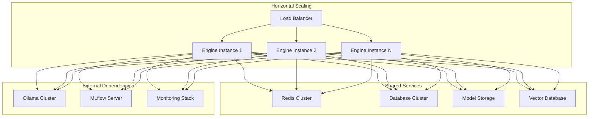

## Security Architecture

### Authentication & Authorization

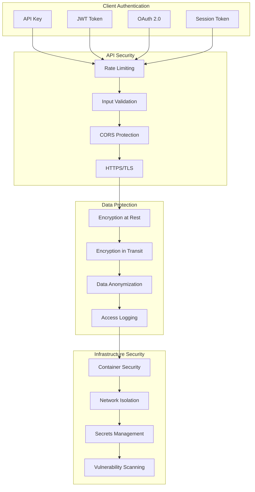

## Observability & Monitoring

### Comprehensive Monitoring Stack

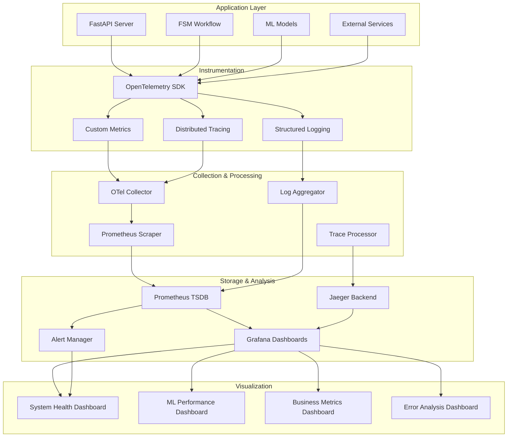

### Key Metrics & KPIs

| Category | Metric | Description | Threshold |
|----------|--------|-------------|-----------|
| **System** | Response Time | API response latency | < 2s |
| **System** | Error Rate | Failed requests percentage | < 1% |
| **System** | Throughput | Requests per second | > 100 |
| **ML** | Classification Accuracy | Disease prediction accuracy | > 85% |
| **ML** | Model Confidence | Average confidence score | > 0.8 |
| **ML** | Inference Time | ML model processing time | < 1s |
| **Business** | Session Completion | Successful workflow completion | > 90% |
| **Business** | User Satisfaction | Positive feedback rate | > 80% |

## Deployment Architecture

### Container Orchestration

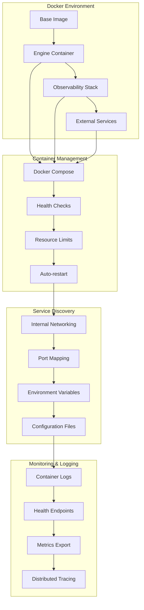

### Production Deployment

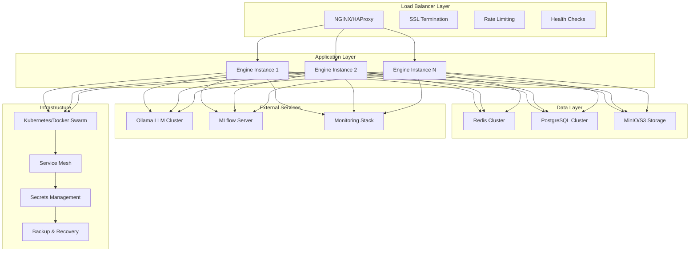

## Technology Stack

### Core Technologies

| Layer | Technology | Version | Purpose |
|-------|------------|---------|---------|
| **Runtime** | Python | 3.11+ | Core application language |
| **Framework** | FastAPI | 0.104+ | Web API framework |
| **Workflow** | LangGraph | 0.2+ | State machine orchestration |
| **ML/AI** | TensorFlow | 2.15+ | CNN model inference |
| **ML/AI** | Ollama | Latest | Local LLM server |
| **ML/AI** | ChromaDB | 0.4+ | Vector database |
| **ML/AI** | MLflow | 2.8+ | Model tracking |
| **Data** | Redis | 7.0+ | Session caching |
| **Data** | PostgreSQL | 15+ | Persistent storage |
| **Observability** | OpenTelemetry | 1.37+ | Instrumentation |
| **Observability** | Prometheus | 2.45+ | Metrics collection |
| **Observability** | Grafana | 10.0+ | Visualization |
| **Observability** | Jaeger | 1.50+ | Distributed tracing |
| **Containerization** | Docker | 24.0+ | Container runtime |
| **Orchestration** | Docker Compose | 2.20+ | Local orchestration |

### Development Tools

| Tool | Purpose | Integration |
|------|---------|-------------|
| **pytest** | Unit testing | CI/CD pipeline |
| **black** | Code formatting | Pre-commit hooks |
| **mypy** | Type checking | IDE integration |
| **pre-commit** | Git hooks | Automated checks |
| **uv** | Package management | Fast dependency resolution |

## API Architecture

### RESTful API Design

```mermaid
graph TB
    subgraph "Core Endpoints"
        A[POST /chat-stream]
        B[POST /chat]
        C[GET /health]
        D[GET /metrics]
    end
    
    subgraph "Session Management"
        E[GET /session/{id}]
        F[GET /session/{id}/history]
        G[DELETE /session/{id}]
        H[POST /session/cleanup]
    end
    
    subgraph "Data Access"
        I[GET /session/{id}/classification]
        J[GET /session/{id}/prescription]
        K[GET /session/{id}/insurance]
        L[GET /session/{id}/vendors]
    end
    
    subgraph "System Management"
        M[GET /stats]
        N[GET /version]
        O[POST /reload]
        P[GET /docs]
    end
    
    A --> E
    B --> E
    C --> M
    D --> M
    
    E --> I
    F --> I
    G --> I
    H --> I
```

### API Response Format

```json
{
  "session_id": "uuid",
  "status": "success|error|in_progress",
  "current_node": "INITIAL|CLASSIFYING|PRESCRIBING|...",
  "assistant_response": "Generated response text",
  "data": {
    "classification": {...},
    "prescription": {...},
    "insurance": {...},
    "vendors": [...]
  },
  "metadata": {
    "timestamp": "2024-01-01T00:00:00Z",
    "processing_time": 1.234,
    "confidence": 0.95
  }
}
```

## Error Handling & Resilience

### Circuit Breaker Pattern

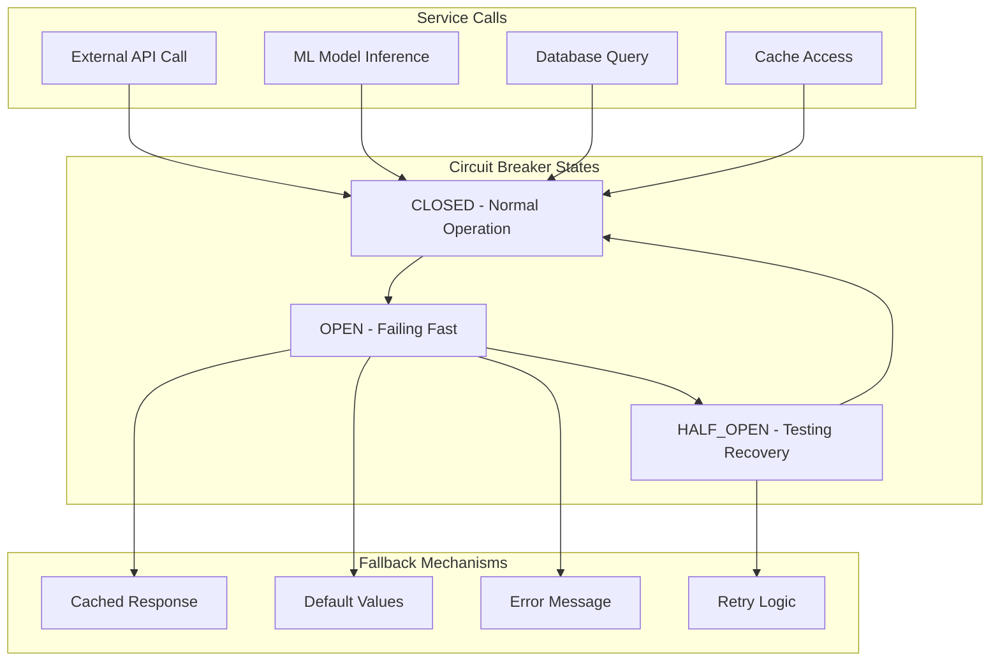

### Retry Strategy

| Service | Max Retries | Backoff | Timeout |
|---------|-------------|---------|---------|
| **LLM Server** | 3 | Exponential | 30s |
| **ML Models** | 2 | Linear | 10s |
| **External APIs** | 3 | Exponential | 15s |
| **Database** | 5 | Linear | 5s |

## Future Architecture Considerations

### Planned Enhancements

1. **Microservices Migration**
   - Split monolithic engine into specialized services
   - Implement service mesh architecture
   - Add API gateway for service discovery

2. **Cloud-Native Deployment**
   - Kubernetes orchestration
   - Auto-scaling based on demand
   - Multi-region deployment

3. **Advanced AI Capabilities**
   - Multi-modal input processing
   - Real-time model updates
   - Federated learning integration

4. **Enhanced Observability**
   - Custom business metrics
   - Predictive alerting
   - Cost optimization insights

### Scalability Roadmap

| Phase | Concurrent Users | Response Time | Features |
|-------|------------------|---------------|----------|
| **Current** | 500 | < 2s | Basic workflow |
| **Phase 1** | 2,000 | < 1.5s | Caching, optimization |
| **Phase 2** | 10,000 | < 1s | Microservices, CDN |
| **Phase 3** | 50,000+ | < 0.5s | Cloud-native, auto-scaling |

## Conclusion

The Sasya Arogya Engine represents a sophisticated, production-ready agricultural intelligence platform built on modern architectural principles. With its comprehensive observability stack, robust error handling, and scalable design, the system is well-positioned to serve farmers with reliable, intelligent agricultural solutions while maintaining high performance and reliability standards.

The architecture's modular design enables easy extension and maintenance, while the comprehensive monitoring and observability stack ensures operational excellence and continuous improvement. The system's foundation in proven technologies and best practices provides a solid platform for future growth and enhancement.

---

*This technical architecture document serves as the definitive guide for understanding, deploying, and maintaining the Sasya Arogya Engine system.*
